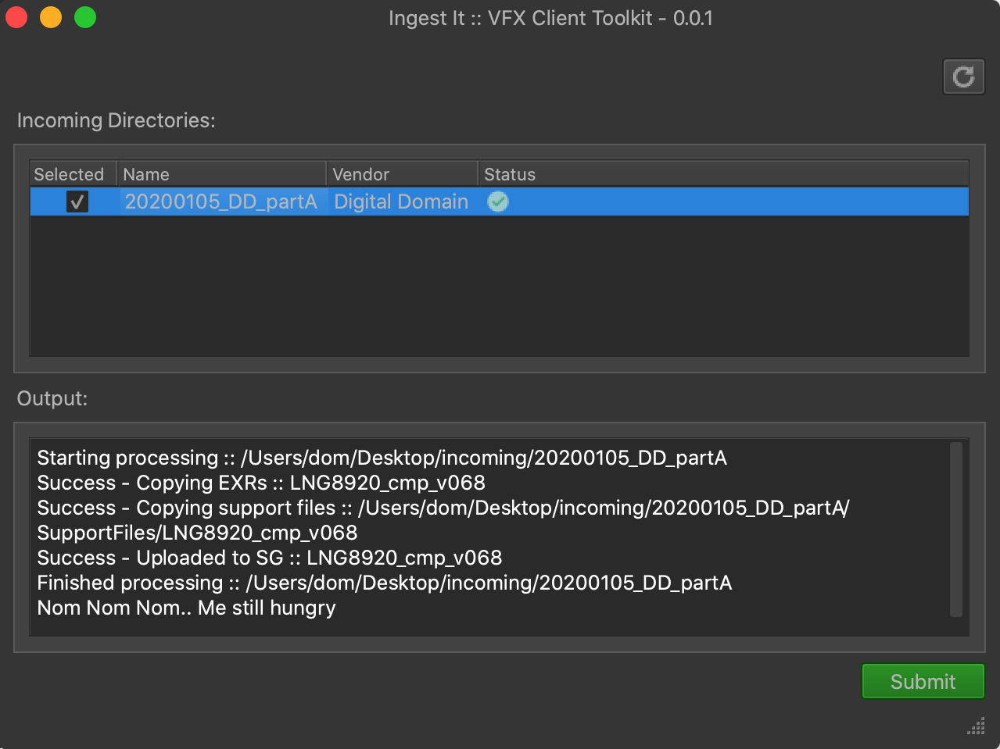
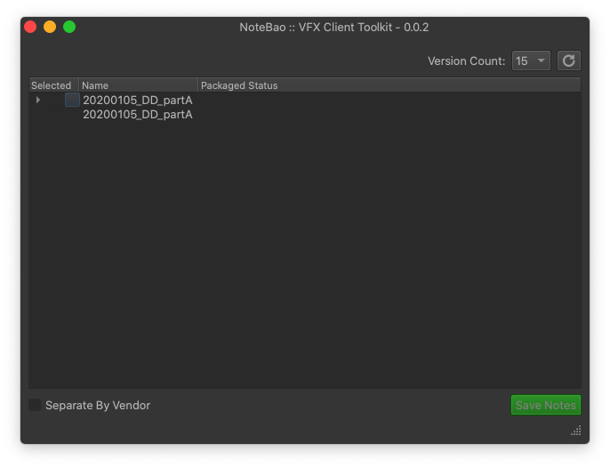
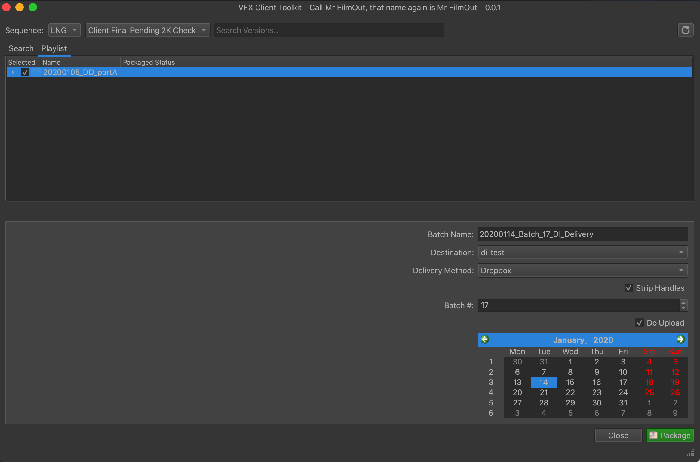
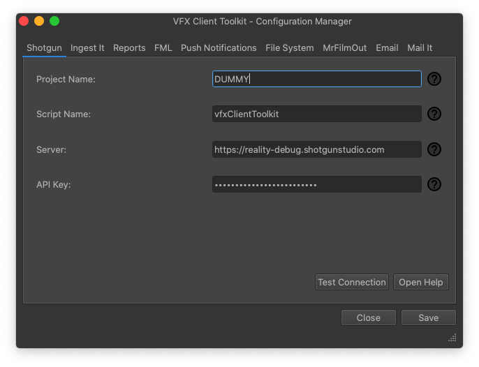

Introduction
------------

The VFX Client Toolkit is a pipeline and series of utilities for management of data and versions when managing a project from the production ("client") side, there are tools to cover every part of the life-cycle of a show:

.. only:: not i18n

  .. note:: At present these tools are only supported for use in tandem with Shotgun but other production tracking software is planned to be supported in the future.

Requirements
------------

- Shotgun (although other production tracking services will be supported in the future).
- Mac/Linux (Windows support currently under development).
- Local network file storage.

Ingest It
---------

   Ingest It Main Window

Developed to automate the ingestion of versions received from vendors with the auto uploading of associated notes into Shotgun as well as copying into a structured 'show-tree' directory structure.

Other features include:

* Configurable to support a number of different manifest file types such as Excel, CSV and JSON file.
* Email and/or push notification upon successful ingest.
* Sanity check of EXR file sequences upon ingest to ensure integrity.
* Version tracking of custom files such as CDLs and colour cubes.

More information can be found here: :doc:`tools/ingestIt`.

NoteBao
-------

   NoteBao Main Window

The management of notes from supervisors, directors and producers can be time consuming if there are multiple vendors presented in each review session and annotations are tracked in Shotgun, NoteBao makes it easy to save these out sorted into different export directories with annotations per version as well as a separate CSV or Excel spreadsheet that can be sent to the vendor.

More information can be found here: :doc:`tools/noteBao`.

Mr Film Out
-----------

   Mr Film Out's Main Window

Upon a shot completion or other milestone it may be required to send out both the MOV and associated data to DI or other vendors, mrFilmOut allows the easy automation and tracking of the creation of these delivery bundles, this tool is to be used in conjunction with IngestIt as it requires that the file system structure is consistent between both utilties, other features include:

* Auto uploading to either SFTP or Dropbox upon successful packaging.
* Creation of manifest file in either Excel or CSV.
* Email notification to different users based on vendor selection.
* Sanity check of EXR files can be run to ensure file sequences are intact and/or mattes are present.

More information can be found here: :doc:`tools/mrFilmOut`.

EDL Builder
-----------

Built for use with `Davinci Resolve <https://www.blackmagicdesign.com/products/davinciresolve/>`_ this makes it easy to build cuts using an EDL with the latest versions (or selected department preferences).

More information can be found here: :doc:`tools/edlBuilder`.

Reports
-------

A configurable email report system that:

* Can be run on a cron to email at repeated periods.
* Generates reports for milestone percentages based on version status (or other custom fields).
* Emails PDF/Excel file
* White/black list for applicable status.
* Can be configured to query other fields such as pathToFrames and highlight if these are missing if meeting certain criteria.

More information can be found here: :doc:`tools/reports`.

Configuration Manager
---------------------

   vfxConfigManager Main Window

Build to allow for easy configuration of all of the different utilities this allows non technical users to manage all the settings of the toolkit.

More information can be found here: :doc:`configuration`.
